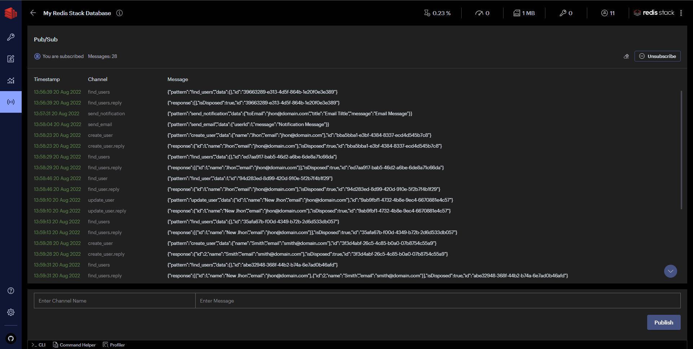

# Microservices With Redis As Transport

## Description

The repo explains implementation of redis as message broker for pub/sub.

This repo contains 2 microservices (user-service and notification-service) and 1 gateway. The client uses gateway to create and access information. 

This is for all deomnstration purpose not production ready.

## Run Application

### Run via Docker Compose

Go to the root of the directory and run the following command

```sh
$ docker-compose up -d
```

For viewing the logs run the following command
```sh
$ docker-compose logs -f -t
```

Now goto http://localhost:8001/redis-stack/pub-sub and subscribe to view realtime events logs.

### Run Normally

Run Redis:

```sh
$ docker run -d --name redis-stack -p 6379:6379 -p 8001:8001 redis/redis-stack:latest

```

Run Gateway:

```sh
$ cd gateway
$ npm install
$ npm run start:dev
```

Run User Service:

```sh
$ cd user-service
$ npm install
$ npm run start:dev
```

Run Notification Service:

```sh
$ cd notification-service
$ npm install
$ npm run start:dev
```

Now goto http://localhost:8001/redis-stack/pub-sub and subscribe to view realtime events logs.

You would see event logs as shown

